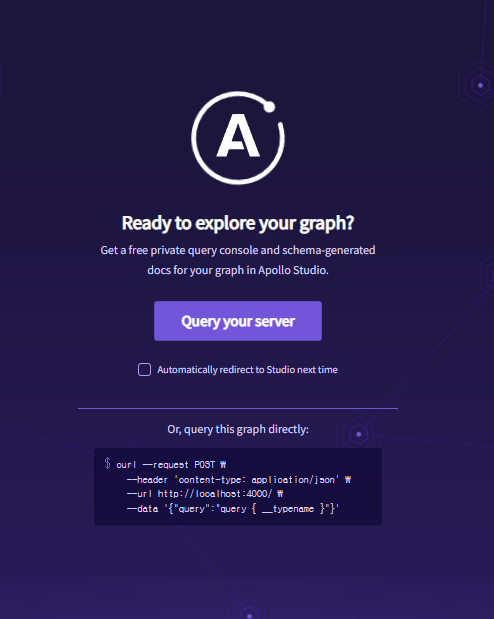
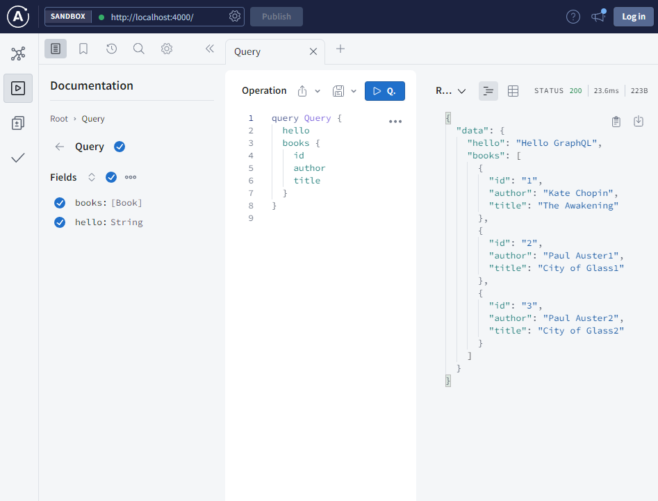

# 서버 구성해보기

참고

-   [Get started with Apollo Server](https://www.apollographql.com/docs/apollo-server/getting-started)

## Package.json

-   설치

```
npm install apollo-server graphql nodemon
```

-   스크립트 추가

```diff
{
"scripts": {
+        "server": "nodemon ./server/index.js"
    },
}
```

## 서버 파일

-   `server/index.js`
-   `typeDef` :
    -   GraphQL 명세에서 사용될 데이터, 요청의 타입 지정
    -   gql(template literal tag)로 생성됨
    -   [활용되는 타입은 여러가지가 있다.](./types.md)

```js
import { ApolloServer, gql } from 'apollo-server';
import { readFileSync } from 'fs';
import { join } from 'path';
import path from 'path';
// esm __dirname 활용을 위해서 작성
import { fileURLToPath } from 'url';
const __filename = fileURLToPath(import.meta.url);
const __dirname = path.dirname(__filename);

const typeDefs = gql`
    type Book {
        id: ID
        title: String
        author: String
    }

    type Query {
        books: [Book]
        hello: String
    }
`;

const hello = 'Hello GraphQL';

// Schema에 해당하는 값을 연결
// 요청을 받아 데이터를 조회, 수정, 삭제
const resolvers = {
    Query: {
        books: () => {
            return JSON.parse(
                readFileSync(join(__dirname, './books.json')).toString()
            );
        },
        hello: () => hello,
    },
};

const server = new ApolloServer({
    typeDefs,
    resolvers,
});

server.listen().then(({ url }) => {
    console.log(`🚀  Server ready at ${url}`);
});
```

## DB 역할의 JSON 파일 구성

-   `server/books.json`

```JSON
[
    { "id": 1, "title": "The Awakening", "author": "Kate Chopin" },
    {
        "id": 2,
        "title": "City of Glass1",
        "author": "Paul Auster1"
    },
    {
        "id": 3,
        "title": "City of Glass2",
        "author": "Paul Auster2"
    }
]

```

## 실행

server 스크립트 실행 -> Query your sever 버튼 클릭



아래 Operation에서 필요한 필드의 query를 작성하면 Postman 처럼 반환 값을 확인 할 수 있다.


