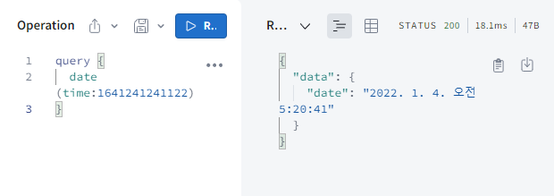

- [타입 시스템](#타입-시스템)
  - [GraphQL Schema Language](#graphql-schema-language)
  - [객체 타입& 필드](#객체-타입-필드)
  - [인자](#인자)
  - [쿼리 & 뮤테이션 타입](#쿼리--뮤테이션-타입)
  - [스칼라 타입](#스칼라-타입)
  - [커스텀 스칼라 타입](#커스텀-스칼라-타입)
  - [열거형 타입](#열거형-타입)
  - [리스트와 Non-null](#리스트와-non-null)
  - [인터페이스](#인터페이스)
  - [유니온 타입](#유니온-타입)
  - [입력 타입](#입력-타입)
  - [변수](#변수)
- [이동](#이동)
  - [다음 문서](#다음-문서)
  - [연관 문서](#연관-문서)

# 타입 시스템

-   참고 : [Graphql korea : 스키마 & 타입](https://graphql-kr.github.io/learn/schema/)

GraphQL 쿼리 언어의 경우 기본적으로 객체의 필드를 지정해야만 한다.
객체의 필드의 타입을 지정 함으로서 받아올 데이터의 형식 예측 및 필요한 데이터를 더잘 표현할 수 있기에 스키마가 필요하다.

쿼리가 들어오면 해당 스키마에 대한 유효성 검사가 된 후 실행된다.

## GraphQL Schema Language

GraphQL은 언어에 얽매이지 않기 위해 독자적인 간단한 언어를 활용한다.
이를 GraphQL schema language라고 한다.

## 객체 타입& 필드

객체 타입 : 서비스에서 가져올 수 있는 객체의 종류와 그 객체의 필드를 나타낸다.

```gql
// 객체 타입
type 객체이름 {
  필드이름: 필드 타입
}

type Character {
  name: String!
  appearsIn: [Episode]!
}
```

## 인자

필드는 0개 이상의 인수를 가질 수 있다.
인자는 모두 이름이 있고, 인자 타입과 인자의 기본값을 지정 할 수 있다.
REST API GET Method에서도 값을 조회하기 위한 인자를 제공하는 경우가 있는데 이에 해당하는 것 같다.

```gql
type Starship {
    id: ID!
    name: String!
    length(unit: LengthUnit = METER): Float
}
```

## 쿼리 & 뮤테이션 타입

-   스키마 대부분이 일반 객체 타입이지만, 스키마 내에는 특수한 타입 쿼리, 뮤테이션 타입이 존재한다.
-   두 타입의 모든 GraphQL 쿼리의 진입점(entry Point)를 나타낸다. (루트 타입)

```gql
type Query {
    hero(episode: Episode): Character
    droid(id: ID!): Droid
}
```

## 스칼라 타입

필드의 구체적인 데이터로 표현되기 위한 쿼리의 끝을 나타낸다.

-   `Int` : 부호가 있는 32비트 정수
-   `Float` : 부호가 있는 부동소수점 값.
-   `String` : UTF-8 문자열.
-   `Boolean` : true 또는 false.
-   `ID` : ID 스칼라 타입은 객체를 다시 요청하거나 캐시의 키로써 자주 사용되는 고유 식별자를 나타냅니다. ID 타입은 String 과 같은 방법으로 직렬화되지만, ID 로 정의하는 것은 사람이 읽을 수 있도록 하는 의도가 아니라는 것을 의미한다.

## 커스텀 스칼라 타입

스칼라 타입을 만들어, 해당 타입을 직렬화, 역 직력화, 유효성 검사를 지정할 수 있다.

-   아래와 같이 `typeDefs`에 추가하고, 커스텀한 스칼라 타입은 `new GraphQLScalarType()` 생성자로 생성할 수 있다.
-   생성된 스칼라 타입을 resolvers에 등록해주면 동작하게 된다.

```gql
scalar Date
```

```js
const dateScalar = new GraphQLScalarType({
    name: 'Date',
    description: 'Date custom scalar type',
    // 외부에서 활용할 수 있게 직렬화 (서버 -> 클라)
    serialize(value) {
        return value.getTime();
    },
    // 변수를 통해 전달된 값을 내부 서버에서 활용할 수 있게 역 직렬화 (클라 -> 서버)
    parseValue(value) {
        return new Date(value);
    },
    // 쿼리를 통해 전달된 값을 내부 서버에서 활용할 수 있게 역 직렬화 (클라 -> 서버)
    parseLiteral(ast) {
        if (ast.kind === Kind.INT) {
            return new Date(parseInt(ast.value, 10));
        }
        return null;
    },
});

const resolvers = {
    Date: dateScalar,
    Query: {
        date: (parent, args, context, info) => {
            return `${args.time.toLocaleString('ko')}`;
        },
    },
};
```

요청을 보내면 아래와 같이 결과를 나타낸다.



## 열거형 타입

Enums라고도 하는 열거형 타입의 경우 특정 값으로 제한되는 특별한 종류의 스칼라이다.

열거형 타입의 역할을 아래와 같다.

-   타입의 인자가 허용된 값 중 하나임을 검증
-   필드가 항상 값의 열거형 집합 중 하나가 될 것임을 타입 시스템을 통해 의사소통

아래 예시와 같이 `enum`으로 열거형을 선언하고 열거형 타입에 들어갈 값을 정하면 된다.

```gql
enum Episode {
    NEWHOPE
    EMPIRE
    JEDI
}
type Video {
    id: ID!
    title: String
    episode: Episode!
}

type Query {
    books: [Book]
    toDos: [Todo]
    toDo(id: ID!): Todo
    date(time: Date): String
    videos: [Video]
}
```

```json
// enum.json
[
    { "id": 1, "episode": "NEWHOPE", "title": "Edit Video" },
    { "id": 2, "episode": "EMPIRE", "title": "Edit Video" },
    { "id": 3, "episode": "JEDI", "title": "Edit Video" },
    { "id": 4, "episode": "NOENUM", "title": "Edit Video" } // 👈 옳지 않은 값
]
```

```js
const resolvers = {
    Query: {
        videos: () => getJSON(),
    },
    Mutation: {
        editVideo: (_, args) => {
            let result;
            setJSON(
                getJSON().map((item) => {
                    if (item.id === +args.id) {
                        const newItem = { ...item, ...args, id: +args.id };
                        result = newItem;
                        return newItem;
                    }
                    return item;
                })
            );
            return result;
        },
    },
};
```

위와 같이 옳지 않는 값이 데이터로 저장되어 있으면 videos 쿼리를 보내면 `"Enum \"Episode\" cannot represent value: \"NOENUM\""` 이라는 에러를 일으켜 열거형 타입 검사가 된다는 것을 알 수 있다.

또한, editVideo 뮤테이션을 보낼 때 episode 인자에 열거형이 아닌 값을 넣으면 아래와 같이 값이 잘못되었다는 에러를 응답한다.

```
"Variable \"$episode\" got invalid value \"NEWOPE\"; Value \"NEWOPE\" does not exist in \"Episode\" enum. Did you mean the enum value \"NEWHOPE\"?"
```

## 리스트와 Non-null

`!`를 통해서 타입에 대해서 필수 여부를 표현할 수 있다.
이를 통해 들오는 값 또는 내보내는 값이 Nullable에 대한 유효성 검사를 할 수 있게 된다.

`[]`를 통해서 타입의 리스트 형태를 표현할 수 있다.

```gql
type Character {
    myField: [String!]
    appearsIn: [Episode]!
}

# myField 자체는 null 값이 될 수 있지만, 내부 아이템은 null 일수 없다.
# appearsIn 자체가 null 값이 될 수 없다. 빈 배열은 가능
# 중첩도 가능하다.
```

## 인터페이스

인터페이스는 타입이 포함해야하는 특정 필드들을 포함하는 추상 타입이다.
타입 정의에 대한 표준화 및 관계를 맺을 수 있게 도와준다.

`interface` 키워드로 선언하고 `implements`로 연결시켜 준다.

```gql
interface Character {
    id: ID!
    name: String!
    friends: [Character]
    appearsIn: [Episode]
}

type Human implements Character {
    id: ID! # 👈 Character
    name: String! # 👈 Character
    friends: [Character] # 👈 Character
    appearsIn: [Episode]! # 👈 Character
    starships: [Starship]
    totalCredits: Int
}

type Droid implements Character {
    id: ID! # 👈 Character
    name: String! # 👈 Character
    friends: [Character] # 👈 Character
    appearsIn: [Episode]! # 👈 Character
    primaryFunction: String
}
```

**위와 같이 인터페이스가 반환값의 타입으로 지정되어 있다면, `implements`로 구체화된 타입을 받아야 하기 때문에 필드 요청시 `인라인 프래그먼트`를 사용해야만 한다.**

```gql
# hero의 episode 값에 의해서 응답을 줄 것이기 때문에 경우에 따라 어떻게 받을지에 대해 쿼리가 필요한 것
query HeroForEpisode($ep: Episode!) {
    hero(episode: $ep) {
        name
        primaryFunction # 👈 you mean to use an inline fragment on \"Droid\"?"
    }
}

query HeroForEpisode($ep: Episode!) {
    hero(episode: $ep) {
        name
        ... on Droid {
            primaryFunction
        }
    }
}
```

## 유니온 타입

```gql
union SearchResult = Human | Droid | Starship
```

인터페이스와 비슷하지만, 타입간에 공통 필드를 특정하지 않는다.
유니온 타입의 멤버는 구체적인 객체 타입이어야 한다. (인터페이스, 다른 유니온 X)

**인터페이스와 마찬가지로, 유니언 타입을 반환하는 필드를 쿼리하면 조건부 프래그먼트를 활용해 어떤 필드라도 내부 어떤 필드로 가져올지 결정해주어야만 한다.**

```gql
{
    search(text: "an") {
        ... on Human {
            name
            height
        }
        ... on Droid {
            name
            primaryFunction
        }
        ... on Starship {
            name
            length
        }
    }
}
```

## 입력 타입

뮤테이션에서 생성될 복잡한 객체를 전달하고자 하는 경우 이를 인자 전용 객체 타입으로 선언할 수 있다.

**입력 객체 타입은 입력 객체 타입 참조가 가능하지만, 입력 및 출력 타입을 스키마에 혼합할 수는 없다.**

````gql
input ReviewInput {
    starts: Int!
    commentary: String
}
``

```gql
mutation CreateReviewForEpisode($ep: Episode!, $review: ReviewInput!) {
  createReview(episode: $ep, review: $review) {
    stars
    commentary
  }
}

## 변수
{
  "ep": "JEDI",
  "review": {
    "stars": 5,
    "commentary": "This is a great movie!"
  }
}
``
````

# 이동

## 다음 문서

-   [GraphQL Query](./query.md)

## 연관 문서

-   [GraphQL Types](./types.md)
-   [GraphQL Mutation](./mutation.md)
-   [Apollo Client LocalState](./localState.md)
