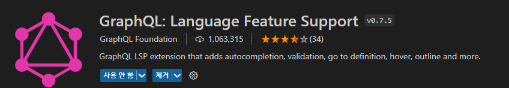
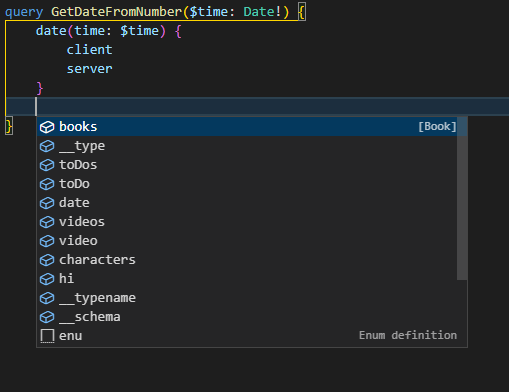
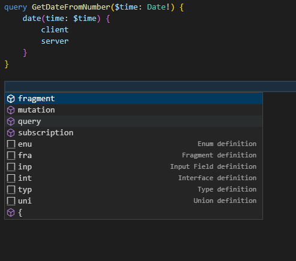
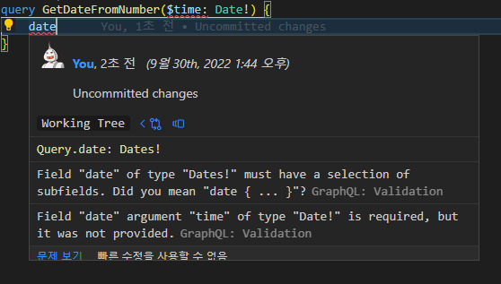

- [VSCode Extension - GraphQL: Language Feature Support](#vscode-extension---graphql-language-feature-support)
  - [1. 배경](#1-배경)
  - [2. GraphQL: Language Feature Support](#2-graphql-language-feature-support)
      - [설정](#설정)

# VSCode Extension - GraphQL: Language Feature Support

## 1. 배경

GraphQL Code Generator를 통해서 쿼리, 뮤테이션, 구독에 대한 작업을 React에서 활용하기 좋게 hook 형태로 만듦과 동시에, 예상 반환 값에 대한 타입도 생성해주는 것으로 React와의 통합 부분에서는 어느 정도 해결이 되었지만 하나 문제가 있다.

**매번, VSCode에 코드 작성시 Docs를 읽거나 SandBox와 같은 외부에서 요청 확인 후 가져와 작성해야 한다는 것이다.**

Apollo Server의 Sandbox에서는 아래의 기능을 제공한다.

-   `자동완성` : 스키마에 따른 쿼리, 뮤테이션, 구독에 대한 작업을 생성할 때 사용할 수 있는 필드 및 작업 종류를 자동완성으로 보여 준다.
-   `유효성 검사` : 쿼리, 뮤테이션, 구독이 스키마 형식에 맞지 않는 경우 경고를 보여준다.
-   `필드 정보` : 필드에 마우스를 오버하면 정보를 보여준다

**위 기능을 VSCode에서 활용할 수 있도록 통합이 필요해 보인다.**

<br />

## 2. GraphQL: Language Feature Support


[Github: GraphQL Language Feature Support](https://github.com/graphql/graphiql/tree/main/packages/vscode-graphql)

`GraphQL: Language Feature Support`는 위에서 말한 자동완성, 유효성 검사, 필드 정보를 Graphql 전용 IDE 처럼 VSCode에서 활용할 수 있게 해준다.

-   graphql에서 정식으로 관리하고 있는 `graphiql` 프로젝트의 `vscode-graphql` 패키지이다.
-   100만 다운로드로 인기가 높다.

#### 설정

1. Extension 설치
2. 설정 파일 작성
    - [GraphQL Config](https://the-guild.dev/graphql/config/docs/user/usage)를 따른다.
    - 이 글에서는 `.graphqlrc.yml` 형식을 적용하였다.

```yml
# .graphqlrc.yml
schema: 'http://localhost:4000'
# 스키마 접근시 인증 헤더가 필요한 경우 아래와 같이 설정한다.
# schema:
#     - '서버 주소':
#           headers:
#               '헤더이름': '값'
documents: './src/**/*.{graphql,js,ts,jsx,tsx}'
```

3. 실행

-   `Ctrl` + `Shift` + `p`를 눌러 VSCode 명령어 실행 드롭다운 열기
-   `VSCode GraphQL: Manual Restart`를 실행
    -   스키마가 달라진 경우, 실행하면 반영된다.

1. 확인

-   graphql 확장자 파일에서 또는 tsx,ts, js, ts 등과 같은 파일에서 tagged template literal 형식으로 바로 쓰는 경우 모두 지원이 된다.
-   `ctrl` + `space`를 눌러 자동 완성 추천을 확인해 보자




